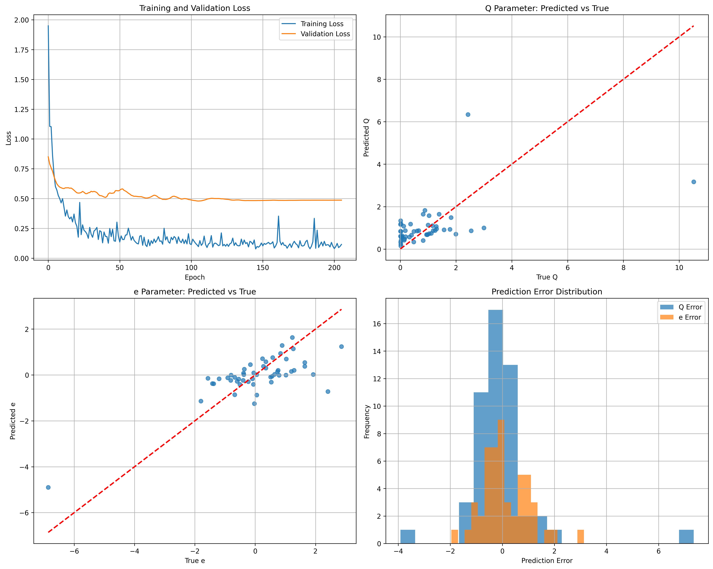

# 模型训练报告

## 1. 摘要

- **数据集**: `results-v4.csv`
- **训练样本总数**: 255
- **描述符**: MACCS Keys + Gasteiger Charges
- **报告生成时间**: 2025-08-17 15:57:39

---

## 2. 训练配置

| 参数 | 值 |
| :--- | :--- |
| `hidden_sizes` | [256, 128, 64] |
| `dropout_rate` | 0.3 |
| `learning_rate` | 0.001 |
| `batch_size` | 64 |
| `epochs` | 300 |
| `early_stopping_patience` | 100 |

---

## 3. 模型评估结果

### 总体性能

| 指标 | 值 |
| :--- | :--- |
| **MSE** | 1.563327 |
| **MAE** | 0.803584 |
| **R² Score** | 0.303545 |

### 参数Q性能

| 指标 | 值 |
| :--- | :--- |
| **MSE** | 2.263432 |
| **MAE** | 0.864575 |
| **R² Score** | 0.051371 |

### 参数e性能

| 指标 | 值 |
| :--- | :--- |
| **MSE** | 0.863222 |
| **MAE** | 0.742592 |
| **R² Score** | 0.555718 |

---

## 4. 训练可视化

