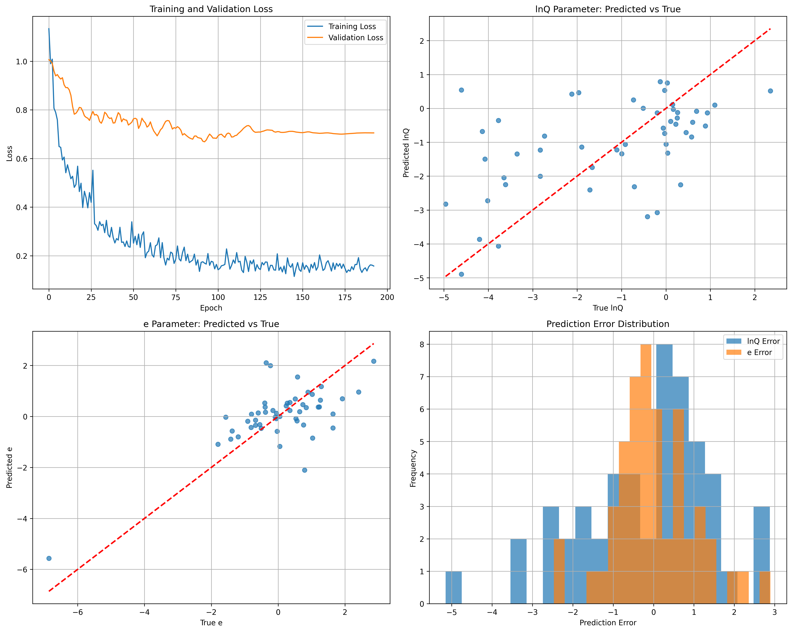

# CNN模型训练报告
## 1. 摘要
- **数据集**: `results-v4.csv`
- **训练样本总数**: 255
- **描述符**: MACCS Keys (167 bits)
- **报告生成时间**: 2025-08-23 17:08:20
---
## 2. 训练配置
| 参数 | 值 |
| :--- | :--- |
| `dropout_rate` | 0.3 |
| `learning_rate` | 0.001 |
| `batch_size` | 64 |
| `epochs` | 300 |
| `early_stopping_patience` | 100 |
---
## 3. 模型评估结果
### 总体性能
| 指标 | 值 |
| :--- | :--- |
| **MSE** | {metrics['overall']['mse']:.6f} |
| **MAE** | {metrics['overall']['mae']:.6f} |
| **R² Score** | {metrics['overall']['r2']:.6f} |
### 参数Q性能
| 指标 | 值 |
| :--- | :--- |
| **MSE** | 2.335278 |
| **MAE** | 0.920591 |
| **R² Score** | 0.021260 |
### 参数e性能
| 指标 | 值 |
| :--- | :--- |
| **MSE** | 1.001029 |
| **MAE** | 0.762152 |
| **R² Score** | 0.484792 |
---
## 4. 训练可视化

