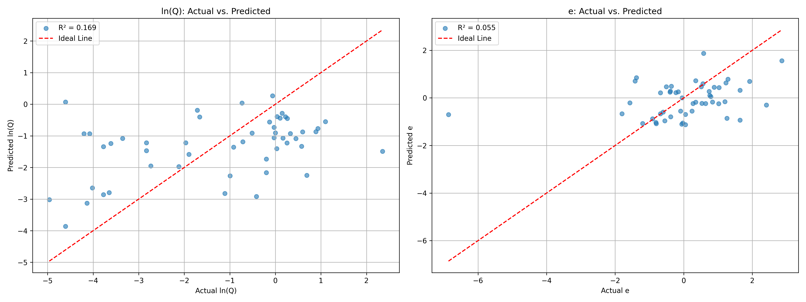

# GCN (PyG) 模型训练报告
## 1. 摘要
- **数据集**: `results-v4.csv`
- **训练样本总数**: 255
- **描述符**: PyG Graph Representation
- **报告生成时间**: 2025-08-25 18:18:18
---
## 2. 训练配置
| 参数 | 值 |
| :--- | :--- |
| `csv_path` | results-v4-with-qm9.csv |
| `epochs` | 300 |
| `batch_size` | 64 |
| `learning_rate` | 0.001 |
| `hidden_dim` | 128 |
| `dropout_rate` | 0.3 |
| `patience` | 30 |
--- 
## 3. 模型评估结果
### 总体 性能
| 指标 | 值 |
| :--- | :--- |
| **MSE** | 2.365472 |
| **MAE** | 1.178478 |
| **R² Score** | 0.111926 |
### LN(Q) 性能
| 指标 | 值 |
| :--- | :--- |
| **MSE** | 2.894258 |
| **MAE** | 1.415093 |
| **R² Score** | 0.169153 |
### E 性能
| 指标 | 值 |
| :--- | :--- |
| **MSE** | 1.836685 |
| **MAE** | 0.941861 |
| **R² Score** | 0.054699 |
---
## 4. 训练可视化

